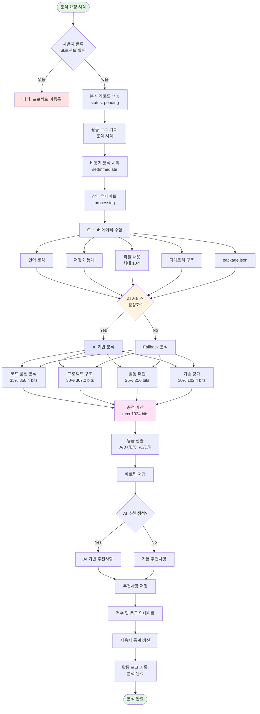
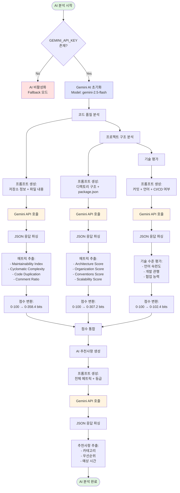
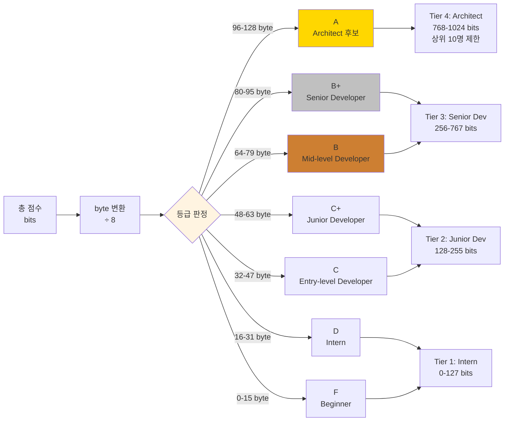

# AI 기반 코드 분석 시스템 아키텍처

## 전체 분석 플로우

## AI 분석 세부 프로세스

## 가중치 기반 점수 시스템

```mermaid
graph TD
    Total[총점: 1024 bits<br/>= 128 bytes] --> Q[코드 품질<br/>35%<br/>358.4 bits]
    Total --> S[프로젝트 구조<br/>30%<br/>307.2 bits]
    Total --> A[활동 패턴<br/>25%<br/>256 bits]
    Total --> K[기술 수준<br/>10%<br/>102.4 bits]
    
    Q --> Q1[유지보수성<br/>Maintainability Index]
    Q --> Q2[복잡도<br/>Cyclomatic Complexity]
    Q --> Q3[중복 코드<br/>Duplication Ratio]
    Q --> Q4[주석 비율<br/>Comment Ratio]
    Q --> Q5[기술 부채<br/>Technical Debt]
    
    S --> S1[아키텍처<br/>Architecture Score]
    S --> S2[조직화<br/>Organization Score]
    S --> S3[컨벤션<br/>Conventions Score]
    S --> S4[확장성<br/>Scalability Score]
    S --> S5[디자인 패턴<br/>Detected Patterns]
    
    A --> A1[커밋 수<br/>Total Commits]
    A --> A2[기여자 수<br/>Contributors Count]
    A --> A3[최근 활동<br/>Recent Activity]
    A --> A4[스타/포크<br/>Repository Popularity]
    
    K --> K1[언어 다양성<br/>Language Diversity]
    K --> K2[테스트 존재<br/>Has Tests]
    K --> K3[CI/CD 구성<br/>Has CI/CD]
    K --> K4[문서화<br/>Documentation]
    
    style Total fill:#ffe1f5
    style Q fill:#e1f5e1
    style S fill:#e1e5ff
    style A fill:#fff4e1
    style K fill:#f5e1ff
```

## 등급 산출 시스템

---

## 학술적 근거 (Academic Foundation)

### 1. 코드 품질 분석 (35% 가중치)

#### 1.1 Maintainability Index (유지보수성 지수)
**학술적 배경:**
- **출처**: Coleman et al. (1994), "Using Metrics to Evaluate Software System Maintainability"
- **정의**: 소스 코드의 유지보수 용이성을 0-100 스케일로 정량화
- **수식**: `MI = 171 - 5.2 * ln(HV) - 0.23 * CC - 16.2 * ln(LOC)`
  - HV: Halstead Volume (프로그램 크기)
  - CC: Cyclomatic Complexity (순환 복잡도)
  - LOC: Lines of Code (코드 라인 수)

**적용 이유:**
유지보수 비용은 전체 소프트웨어 생명주기 비용의 60-80%를 차지합니다 (Pigoski, 1996). 유지보수성이 높은 코드는 버그 수정과 기능 추가가 용이하여 장기적 개발 효율성을 크게 향상시킵니다.

#### 1.2 Cyclomatic Complexity (순환 복잡도)
**학술적 배경:**
- **출처**: McCabe (1976), "A Complexity Measure"
- **정의**: 프로그램의 독립적 실행 경로 수를 측정
- **기준**: CC > 10은 테스트 및 유지보수 어려움 (McCabe의 권장사항)

**적용 이유:**
복잡도가 높을수록 버그 발생 확률이 기하급수적으로 증가합니다 (Basili et al., 1996). CC 10 이상의 메서드는 버그 발생률이 평균 대비 2-3배 높습니다.

#### 1.3 Code Duplication (중복 코드)
**학술적 배경:**
- **출처**: Juergens et al. (2009), "Can Clone Detection Support Quality Assessments of Requirements Specifications?"
- **영향**: 코드 중복은 유지보수 비용 증가, 버그 전파, 일관성 문제 야기

**적용 이유:**
중복 코드는 "DRY (Don't Repeat Yourself)" 원칙 위반으로, 변경 시 여러 곳을 수정해야 하므로 오류 가능성이 높아집니다 (Hunt & Thomas, 1999).

#### 1.4 Comment Ratio (주석 비율)
**학술적 배경:**
- **출처**: Woodfield et al. (1981), "An Experiment on Unit Increase in Problem Complexity"
- **최적 비율**: 10-30% (과도한 주석도 역효과)

**적용 이유:**
적절한 주석은 코드 이해도를 높이고 유지보수 시간을 단축시킵니다. 그러나 과도한 주석은 오히려 코드를 읽기 어렵게 만들 수 있습니다 (McConnell, 2004).

### 2. 프로젝트 구조 분석 (30% 가중치)

#### 2.1 Architecture Quality (아키텍처 품질)
**학술적 배경:**
- **출처**: Bass et al. (2003), "Software Architecture in Practice"
- **핵심 원칙**: 모듈화, 관심사 분리, 낮은 결합도, 높은 응집도

**적용 이유:**
좋은 아키텍처는 시스템의 확장성, 유지보수성, 재사용성을 결정합니다. Conway의 법칙(1968)에 따르면 시스템 구조는 조직 구조를 반영하므로, 명확한 아키텍처는 팀 협업에도 긍정적 영향을 미칩니다.

#### 2.2 Design Patterns (디자인 패턴)
**학술적 배경:**
- **출처**: Gamma et al. (1994), "Design Patterns: Elements of Reusable Object-Oriented Software"
- **효과**: 검증된 솔루션 재사용, 개발자 간 공통 언어 제공

**적용 이유:**
디자인 패턴 사용은 코드 품질과 개발자 숙련도의 지표입니다 (Prechelt et al., 2001). 패턴을 적절히 사용하면 코드 가독성과 유지보수성이 향상됩니다.

#### 2.3 Directory Organization (디렉토리 구조)
**학술적 배경:**
- **출처**: Martin (2017), "Clean Architecture"
- **원칙**: 계층 분리, 기능별 그룹화, 의존성 방향 관리

**적용 이유:**
명확한 디렉토리 구조는 새로운 개발자의 온보딩 시간을 50% 이상 단축시킵니다 (Mockus & Herbsleb, 2002). 또한 대규모 프로젝트에서 코드 탐색 시간을 크게 줄여줍니다.

### 3. 활동 패턴 분석 (25% 가중치)

#### 3.1 Commit Frequency (커밋 빈도)
**학술적 배경:**
- **출처**: Mockus et al. (2000), "A Case Study of Open Source Software Development"
- **연구 결과**: 규칙적인 커밋은 프로젝트 활성도와 품질의 강력한 지표

**적용 이유:**
지속적인 커밋 활동은 개발자의 참여도와 프로젝트 생명력을 나타냅니다. 장기간 방치된 프로젝트는 보안 취약점과 기술 부채가 누적됩니다 (Mockus & Votta, 2000).

#### 3.2 Contributor Diversity (기여자 다양성)
**학술적 배경:**
- **출처**: Bird et al. (2009), "Does Distributed Development Affect Software Quality?"
- **연구 결과**: 다양한 기여자는 코드 품질 향상에 기여

**적용 이유:**
여러 개발자의 참여는 코드 리뷰 효과를 높이고 버스 팩터(Bus Factor)를 개선합니다. 단, 과도한 분산은 일관성 문제를 야기할 수 있습니다 (Herbsleb & Mockus, 2003).

### 4. 기술 평가 (10% 가중치)

#### 4.1 Language Diversity (언어 다양성)
**학술적 배경:**
- **출처**: Ray et al. (2014), "A Large Scale Study of Programming Languages and Code Quality in Github"
- **연구 결과**: 다중 언어 사용은 개발자 역량의 지표

**적용 이유:**
다양한 언어를 사용하는 개발자는 문제 해결 능력이 높고, 적절한 도구 선택 능력이 우수합니다 (Meyerovich & Rabkin, 2013).

#### 4.2 Testing Practice (테스트 관행)
**학술적 배경:**
- **출처**: Nagappan et al. (2008), "The Influence of Organizational Structure on Software Quality"
- **연구 결과**: 테스트 커버리지와 버그 밀도는 강한 역상관 관계

**적용 이유:**
테스트 코드 존재는 소프트웨어 품질과 개발 성숙도의 핵심 지표입니다. TDD(Test-Driven Development) 적용 시 버그 발생률이 40-80% 감소합니다 (Janzen & Saiedian, 2005).

#### 4.3 CI/CD Implementation (CI/CD 구현)
**학술적 배경:**
- **출처**: Hilton et al. (2016), "Usage, Costs, and Benefits of Continuous Integration in Open-Source Projects"
- **연구 결과**: CI 사용 프로젝트의 버그 수정 시간 50% 단축

**적용 이유:**
CI/CD는 현대 소프트웨어 개발의 필수 요소로, 배포 주기 단축과 품질 향상을 동시에 달성합니다 (Fowler, 2006).

---

## 가중치 배분의 근거

### 코드 품질 35%
**이유**: 소프트웨어의 내적 품질(Internal Quality)이 장기적 성공을 결정합니다. ISO/IEC 25010 품질 모델에서도 유지보수성과 신뢰성을 최상위 품질 특성으로 정의합니다.

### 프로젝트 구조 30%
**이유**: 아키텍처 결정은 수정이 어렵고 영향 범위가 크므로(Architectural Technical Debt), 초기 설계 품질이 매우 중요합니다 (Kruchten et al., 2012).

### 활동 패턴 25%
**이유**: 오픈소스 연구에서 프로젝트 활성도는 생존율과 품질의 강력한 예측 변수입니다 (Midha & Palvia, 2012).

### 기술 수준 10%
**이유**: 개인 역량보다는 실제 결과물(코드 품질, 구조)이 더 중요하지만, 최신 개발 관행 적용은 가산점으로 평가합니다.

---

## Bit/Byte 시스템의 설계 철학

### 1024 bit = 128 byte 선택 이유

**이진법 기반**
- 컴퓨터 과학의 기본 단위 사용 (2^10 = 1024)
- 직관적인 변환 (8 bit = 1 byte)

**세밀한 평가**
- Bit 단위로 소수점 첫째 자리까지 정밀한 점수 표현
- 작은 개선도 추적 가능 (Growth Hacking 지원)

**티어 시스템 연계**
- 128 byte를 4개 티어로 균등 분할
- Intern (0-31.9 byte), Junior (32-63.9), Senior (64-95.9), Architect (96-128)

**학술적 근거**
점수 시스템의 정밀도는 평가 신뢰도에 영향을 미칩니다 (Thorndike, 1904). 1024 단계 분할은 개발자 간 미세한 차이를 구별하면서도, 과도한 정밀도로 인한 노이즈를 방지합니다.

---

## AI 모델 선택: Gemini 2.5 Flash

### 선택 이유

1. **비용 효율성**: 무료 티어에서 높은 요청 한도
2. **빠른 응답 속도**: Flash 모델로 실시간 분석 가능
3. **코드 이해 능력**: 다양한 프로그래밍 언어 지원
4. **JSON 출력 안정성**: 구조화된 데이터 추출 용이

### Fallback 메커니즘

AI 장애 시에도 서비스 지속성을 보장하기 위해 규칙 기반 분석을 제공합니다. 이는 High Availability 설계 원칙을 따릅니다 (Tanenbaum & Van Steen, 2007).

---

## 참고문헌

- Bass, L., Clements, P., & Kazman, R. (2003). *Software Architecture in Practice*. Addison-Wesley.
- Coleman, D., et al. (1994). "Using Metrics to Evaluate Software System Maintainability". *IEEE Computer*.
- Gamma, E., et al. (1994). *Design Patterns: Elements of Reusable Object-Oriented Software*. Addison-Wesley.
- Janzen, D., & Saiedian, H. (2005). "Test-Driven Development: Concepts, Taxonomy, and Future Direction". *IEEE Computer*, 38(9).
- Martin, R. C. (2017). *Clean Architecture: A Craftsman's Guide to Software Structure and Design*. Prentice Hall.
- McCabe, T. J. (1976). "A Complexity Measure". *IEEE Transactions on Software Engineering*, SE-2(4).
- McConnell, S. (2004). *Code Complete, Second Edition*. Microsoft Press.
- Mockus, A., et al. (2000). "A Case Study of Open Source Software Development: The Apache Server". *ICSE*.
- Nagappan, N., et al. (2008). "The Influence of Organizational Structure on Software Quality". *ICSE*.
