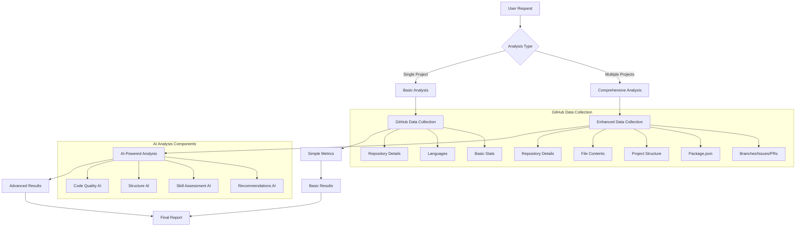
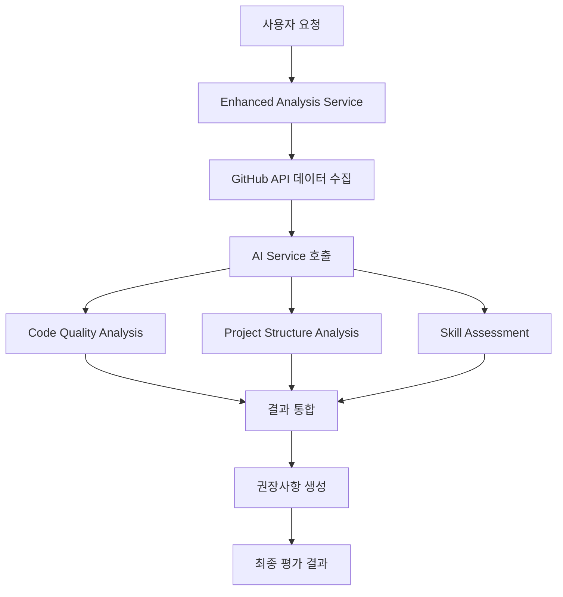
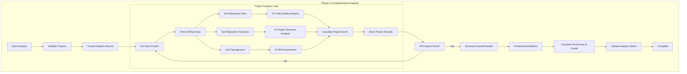
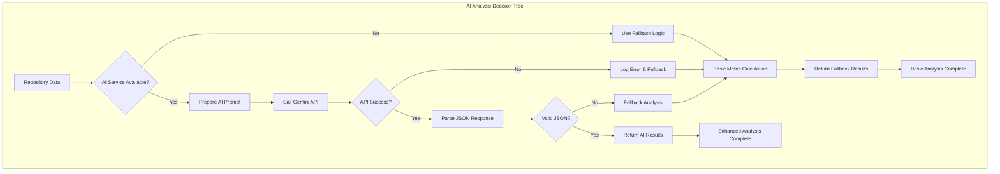
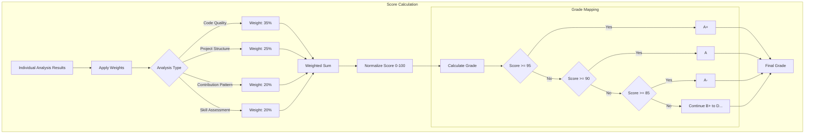
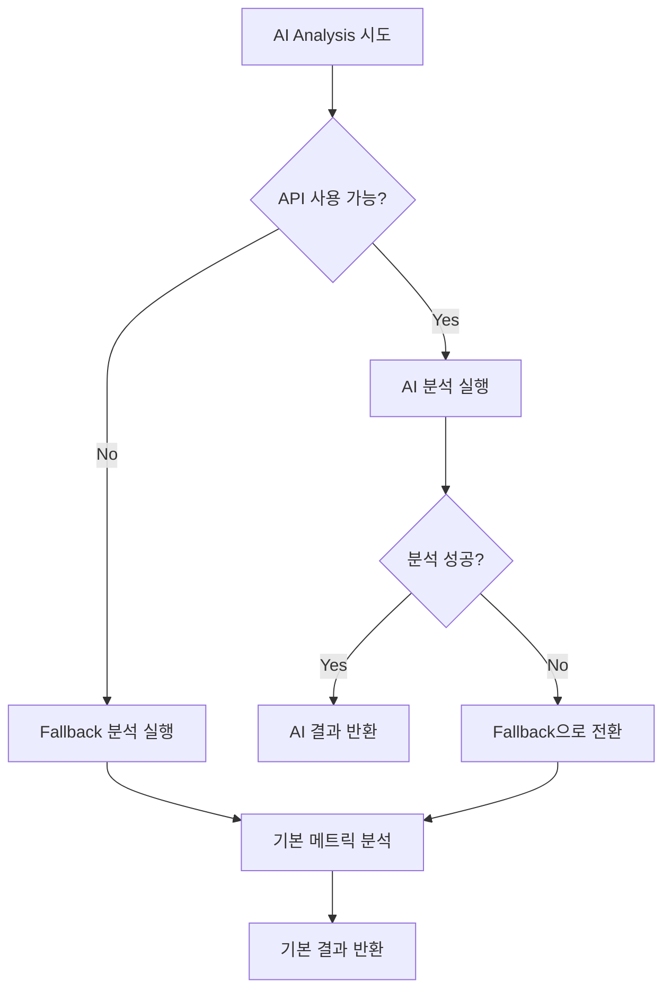
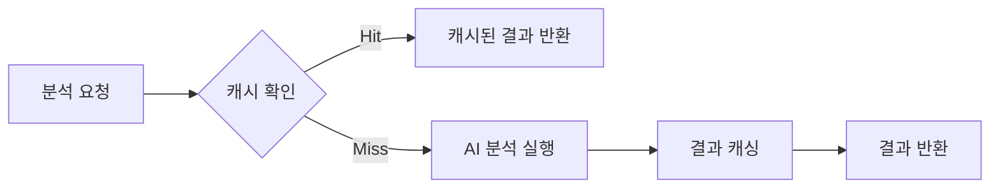
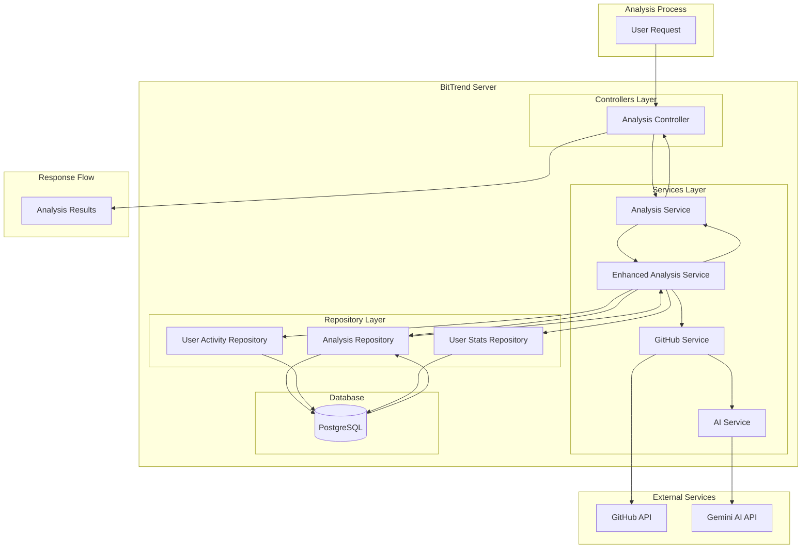
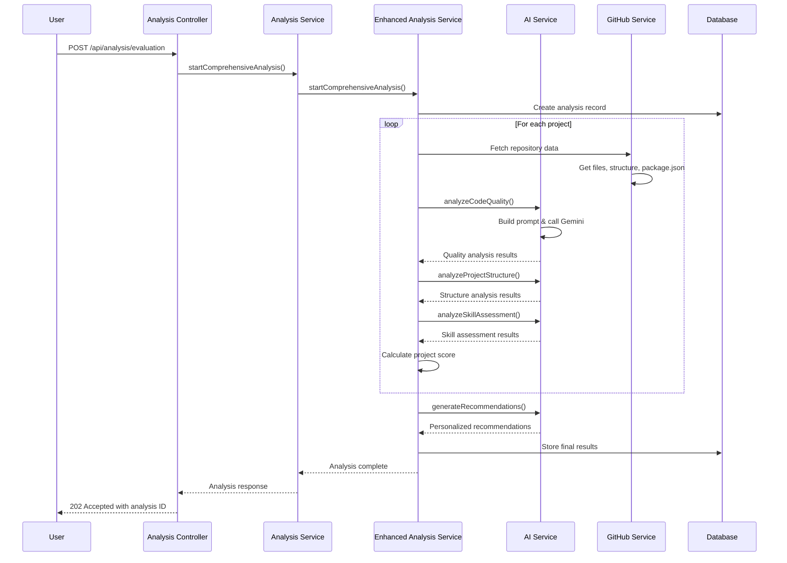
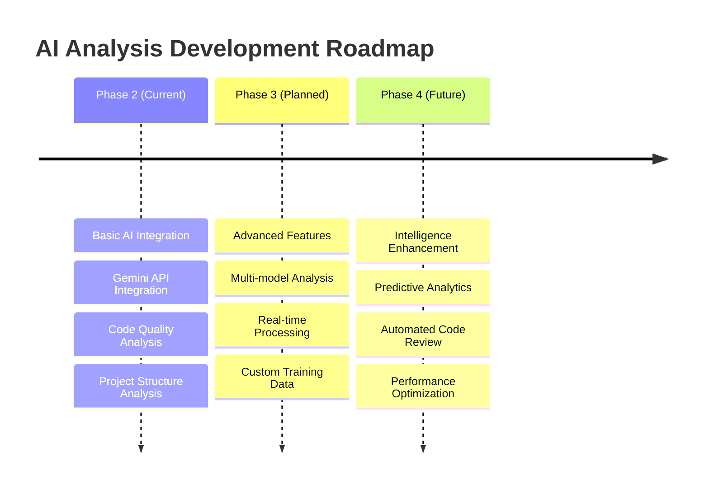

# AI Analysis System Documentation

BitTrend의 Phase 2에서 구현된 AI 기반 분석 시스템에 대한 상세 문서입니다. Google Gemini API를 활용하여 GitHub 리포지토리의 코드 품질, 프로젝트 구조, 스킬 평가를 수행합니다.

## Overview

### Why AI Analysis?

기존의 간단한 메트릭 기반 분석에서 벗어나 실제 코드 내용과 패턴을 분석하여 더 정확하고 유의미한 평가를 제공하기 위해 AI를 도입했습니다.

**기존 분석의 한계:**
- 단순한 수치 기반 평가 (파일 수, 커밋 수, stars 등)
- 실제 코드 품질과 개발자 스킬을 반영하지 못함
- 일반화된 평가로 개별 특성을 고려하지 못함

**AI 분석의 장점:**
- 실제 코드 내용을 읽고 분석
- 코딩 패턴, 아키텍처 선택, 베스트 프랙티스 준수 여부 평가
- 개인화된 개선 권장사항 생성
- 컨텍스트를 고려한 종합적 평가

## System Architecture

### Overall Analysis Flow



### AI Service Layer (`src/services/ai.service.js`)

AI 서비스는 단일 인스턴스로 관리되며, 다음과 같은 핵심 기능을 제공합니다:

1. **Code Quality Analysis** - 코드 품질 분석
2. **Project Structure Analysis** - 프로젝트 구조 분석
3. **Skill Assessment** - 개발자 스킬 평가
4. **Recommendations Generation** - 개선 권장사항 생성

### Enhanced Analysis Service (`src/services/enhancedAnalysis.service.js`)

전체 분석 프로세스를 관리하고 AI 서비스와 기존 시스템을 연결합니다.



### Detailed Analysis Logic Flow



### AI Decision Making Process



### Scoring and Grading Logic



## AI Analysis Components

### 1. Code Quality Analysis

**목적:** 코드의 품질과 유지보수성을 AI로 평가

**입력 데이터:**
- 리포지토리 기본 정보 (언어, 크기, 설명 등)
- 샘플 파일 내용 (최대 10개 파일, 각 500자)
- 언어별 사용 비율

**평가 항목:**
- `maintainabilityIndex`: 유지보수성 지수 (0-100)
- `cyclomaticComplexity`: 순환 복잡도 평균
- `cognitiveComplexity`: 인지 복잡도 평균
- `duplicatedCodeRatio`: 중복 코드 비율 (%)
- `commentRatio`: 주석 비율 (%)
- `technicalDebt`: 기술 부채 수준 (Low/Medium/High)

**AI 프롬프트 설계 이유:**

```javascript
// 프롬프트 구조
Repository Information -> Language Statistics -> Sample Code -> Analysis Request
```

이 구조를 선택한 이유:
1. **컨텍스트 제공**: 리포지토리 전체 정보를 먼저 제공하여 AI가 전체적인 맥락을 이해
2. **언어별 특성 고려**: 각 언어의 특성에 맞는 분석 기준 적용
3. **실제 코드 분석**: 수치가 아닌 실제 코드를 보고 판단
4. **구조화된 출력**: JSON 형태로 일관된 결과 보장

### 2. Project Structure Analysis

**목적:** 프로젝트의 아키텍처와 조직 구조 평가

**입력 데이터:**
- 파일/디렉토리 구조 (최대 100개)
- package.json 의존성 정보
- 리포지토리 메타데이터

**평가 항목:**
- `architectureScore`: 아키텍처 패턴 점수
- `organizationScore`: 파일 조직 점수
- `conventionsScore`: 네이밍 규칙 준수도
- `scalabilityScore`: 확장성 점수

**설계 근거:**
- **파일 구조 분석**: 실제 프로젝트 구조를 보고 아키텍처 패턴 감지
- **의존성 분석**: package.json을 통해 기술 스택 적절성 평가
- **규칙 준수도**: 업계 표준 네이밍 컨벤션 적용

### 3. Skill Assessment

**목적:** 개발자의 기술 숙련도와 전문성 평가

**입력 데이터:**
- 기술적 지표 (커밋 수, 기여자 수 등)
- 사용 기술 스택
- 프로젝트 복잡도

**평가 결과:**
- `skillLevel`: Beginner/Intermediate/Advanced/Expert
- `technicalProficiency`: 기술별 숙련도
- `frameworkMastery`: 프레임워크 활용도
- `detectedSkills`: 감지된 기술 목록

**평가 기준 설계:**
1. **기술 스택 다양성**: 얼마나 많은 기술을 적절히 활용하는가
2. **코드 복잡도**: 복잡한 문제를 얼마나 잘 해결하는가
3. **베스트 프랙티스**: 업계 표준을 얼마나 잘 따르는가
4. **혁신성**: 새로운 접근 방식이나 창의적 해결책이 있는가

### 4. Recommendations Generation

**목적:** 개인화된 개선 권장사항 생성

**입력 데이터:**
- 모든 분석 결과 통합
- 사용자 컨텍스트 정보

**출력 형태:**
```javascript
{
  "priority": "high|medium|low",
  "category": "code_quality|testing|documentation|architecture|performance|security",
  "title": "구체적인 제목",
  "description": "상세 설명",
  "actionItems": ["실행 가능한 단계들"],
  "estimatedImpact": "예상 점수 향상",
  "effort": "필요한 노력 수준",
  "timeframe": "예상 소요 시간"
}
```

**권장사항 우선순위 결정 로직:**
1. **영향도 vs 노력**: 높은 영향도, 적은 노력 우선
2. **현재 스킬 레벨**: 사용자 수준에 맞는 권장사항
3. **프로젝트 목표**: 분석 결과와 일치하는 개선 방향

## Fallback Mechanisms

AI 서비스가 비활성화되거나 오류가 발생할 경우를 대비한 fallback 메커니즘:

### Graceful Degradation Strategy



**Fallback 분석 특징:**
- AI 없이도 기본적인 평가 제공
- 리포지토리 메타데이터 기반 점수 계산
- 일반적인 권장사항 제공
- 사용자에게 제한 사항 안내

## Prompt Engineering

### Core Principles

1. **명확한 구조**: 입력 데이터를 논리적 순서로 제공
2. **구체적 지시사항**: 평가 기준과 출력 형식 명시
3. **컨텍스트 제공**: 분석 목적과 배경 설명
4. **오류 방지**: JSON 스키마와 검증 규칙 포함

### Code Quality Prompt Example

```
Analyze the code quality of this ${language} project:

Repository Information:
- Name: ${name}
- Description: ${description}
- Language: ${language}
- Size: ${size} KB

Language Statistics: ${languageStats}

Sample File Contents: ${fileContents}

Return JSON with specific metrics and analysis...
```

**이 구조를 선택한 이유:**

1. **순차적 정보 제공**: 큰 그림에서 세부사항으로
2. **언어별 특성화**: 각 언어의 특성을 고려한 분석
3. **실제 코드 포함**: 수치가 아닌 실제 내용 기반 판단
4. **구조화된 출력**: 일관된 형태의 결과 보장

### Project Structure Prompt Design

프로젝트 구조 분석 프롬프트는 다음 요소들을 고려합니다:

- **디렉토리 명명 규칙**: src/, components/, utils/ 등
- **관심사의 분리**: 기능별, 레이어별 분리 정도
- **의존성 관리**: package.json의 의존성 적절성
- **확장성**: 프로젝트가 커질 때의 대응 가능성

## Performance Considerations

### API Rate Limiting

- Gemini API 호출 빈도 제한 고려
- 요청 크기 최적화 (파일 내용 500자 제한)
- 배치 처리로 효율성 향상

### Caching Strategy



- 동일한 리포지토리 재분석 시 캐시 활용
- 파일 변경 감지로 캐시 무효화
- 메모리 사용량 최적화

## Error Handling

### AI Service Error Types

1. **API Key 없음**: 환경 변수 미설정
2. **Rate Limit**: API 호출 한도 초과
3. **Parse Error**: JSON 응답 파싱 실패
4. **Network Error**: 네트워크 연결 문제

### Recovery Strategies

- **Exponential Backoff**: 일시적 오류 시 재시도
- **Circuit Breaker**: 지속적 오류 시 fallback 전환
- **Graceful Degradation**: AI 없이도 기본 기능 제공

### Data Flow and Integration Architecture



### Service Integration Points



### Graceful Degradation Strategy


## Security Considerations

### Data Privacy

- 코드 내용은 분석을 위해서만 임시 사용
- API 요청 로깅 시 민감 정보 제거
- 사용자 인증 토큰 안전 관리

### API Key Management

```javascript
// 환경 변수로 안전하게 관리
if (!process.env.GEMINI_API_KEY) {
  console.warn('GEMINI_API_KEY not set. AI analysis features will be disabled.');
  this.enabled = false;
}
```

## Monitoring and Observability

### Metrics to Track

- AI 분석 성공률
- 응답 시간 분포
- Fallback 사용 빈도
- 사용자 만족도 (분석 결과 유용성)

### Logging Strategy

```javascript
// 구조화된 로깅
console.log({
  type: 'ai_analysis',
  analysisId: analysisId,
  duration: performance.now() - startTime,
  success: true,
  itemsAnalyzed: projectResults.length
});
```

## Future Enhancements

### Planned Improvements

1. **더 정교한 프롬프트**: 도메인별 특화 분석
2. **다중 모델 활용**: 다른 AI 모델과 결과 비교
3. **학습 데이터 축적**: 사용자 피드백 기반 개선
4. **실시간 분석**: 코드 변경 시 즉시 분석

### Technology Roadmap



## Configuration

### Environment Variables

```env
# Required for AI features
GEMINI_API_KEY=your_gemini_api_key_here

# Optional: AI feature toggles
ENABLE_AI_CODE_QUALITY=true
ENABLE_AI_STRUCTURE_ANALYSIS=true
ENABLE_AI_SKILL_ASSESSMENT=true
ENABLE_AI_RECOMMENDATIONS=true

# Performance tuning
AI_MAX_FILE_SIZE=500
AI_MAX_FILES_ANALYZED=10
AI_CACHE_TTL=3600
```

### Feature Flags

AI 기능을 점진적으로 활성화할 수 있는 기능 플래그 시스템:

```javascript
const analysisOptions = {
  includeCodeQuality: process.env.ENABLE_AI_CODE_QUALITY !== 'false',
  includeProjectStructure: process.env.ENABLE_AI_STRUCTURE_ANALYSIS !== 'false',
  includeSkillAssessment: process.env.ENABLE_AI_SKILL_ASSESSMENT !== 'false',
  generateRecommendations: process.env.ENABLE_AI_RECOMMENDATIONS !== 'false'
};
```

이를 통해 운영 중에도 안전하게 AI 기능을 제어할 수 있습니다.